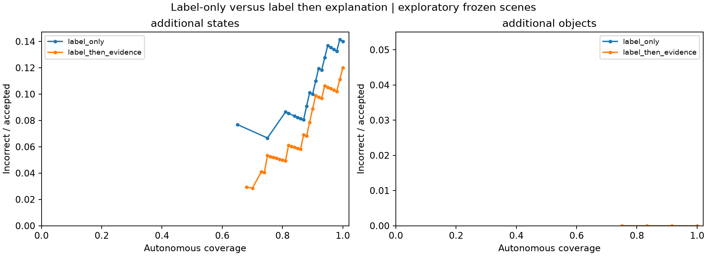

# Label-then-explanation: expanded paired experiment

112 additional scene-target pairs / 224 fresh calls: 100 states 1–10 across ten LIBERO-Object targets, and 12 other-object fresh-reset captures. No state-0 pilot results are pooled. Explanation-first was not run. Results below compare new label-only calls with new label-then-explanation calls.

## Results

| Cohort | Format | Correct | AUROC | AURC | Mean raw likelihood | Wrong >=.99 | Score availability |
| --- | --- | ---: | ---: | ---: | ---: | ---: | ---: |
| additional_states | label_only | 86/100 | 0.718439 | 0.0573545 | 0.995491 | 13 | 100.0% |
| additional_states | label_then_evidence | 88/100 | 0.823864 | 0.0317073 | 0.983419 | 7 | 100.0% |
| additional_objects | label_only | 12/12 | unavailable | 0 | 0.999839 | 0 | 100.0% |
| additional_objects | label_then_evidence | 12/12 | unavailable | 0 | 0.999941 | 0 | 100.0% |
| pooled | label_only | 98/112 | 0.716837 | 0.0504944 | 0.995956 | 13 | 100.0% |
| pooled | label_then_evidence | 100/112 | 0.8275 | 0.0272493 | 0.985189 | 7 | 100.0% |

additional_states: wrong→correct 6; correct→wrong 4; both wrong 8; both correct 82.


additional_objects: wrong→correct 0; correct→wrong 0; both wrong 0; both correct 12.


pooled: wrong→correct 6; correct→wrong 4; both wrong 8; both correct 94.

## Every target

| Target | Scenes | Label only correct | Label + explanation correct |
| --- | ---: | ---: | ---: |
| alphabet soup | 10 | 4 | 6 |
| bbq sauce | 10 | 10 | 9 |
| black bowl | 1 | 1 | 1 |
| book | 1 | 1 | 1 |
| butter | 10 | 10 | 10 |
| chocolate pudding | 10 | 10 | 10 |
| cookies | 1 | 1 | 1 |
| cream cheese | 10 | 10 | 10 |
| frying pan | 1 | 1 | 1 |
| ketchup | 10 | 10 | 10 |
| milk | 10 | 10 | 10 |
| moka pot | 1 | 1 | 1 |
| orange juice | 10 | 10 | 10 |
| plate | 1 | 1 | 1 |
| ramekin | 1 | 1 | 1 |
| red mug | 1 | 1 | 1 |
| salad dressing | 10 | 10 | 10 |
| tomato sauce | 10 | 2 | 3 |
| white mug | 1 | 1 | 1 |
| wine bottle | 1 | 1 | 1 |
| wooden tray | 1 | 1 | 1 |
| yellow and white mug | 1 | 1 | 1 |

## Matched coverage / human deferral

Only exactly shared attainable coverage is compared; no optimistic ordering inside ties. The full table and both false-acceptance-rate denominators are in matched_coverage.csv. Rows below show the highest shared coverage not exceeding each reference level, not selected deployment thresholds.

| Cohort | Requested coverage | Actual coverage | Label-only false accepts | Label + explanation false accepts |
| --- | ---: | ---: | ---: | ---: |
| additional_states | 50% | unavailable | — | — |
| additional_states | 75% | 75.0% | 5 | 4 |
| additional_states | 90% | 90.0% | 9 | 8 |
| additional_states | 100% | 100.0% | 14 | 12 |
| additional_objects | 50% | unavailable | — | — |
| additional_objects | 75% | 75.0% | 0 | 0 |
| additional_objects | 90% | 83.3% | 0 | 0 |
| additional_objects | 100% | 100.0% | 0 | 0 |
| pooled | 50% | unavailable | — | — |
| pooled | 75% | 75.0% | 5 | 3 |
| pooled | 90% | 89.3% | 9 | 6 |
| pooled | 100% | 100.0% | 14 | 12 |

## Controls and limitations

Same `gpt-4.1-mini-2025-04-14`, temperature 0, detail high, shared format-neutral system prompt, max_completion_tokens=128, top_logprobs=20. Same frozen RGB/localization/candidate metadata/order, known-presence assertion, and direct visual letters within each pair. The new-object sheets only replace crop-header IDs with letters; non-label pixel equality is checked using the existing renderer. There are 3–6 candidates in the new-object cohort versus seven in LIBERO-Object, so separate cohort results matter. No objects or poses were recaptured.

Score = exp(sum of original generated decision-bearing label-token logprobs), excluding separable formatting and explanation tokens. Generated choice selects the object, not the largest top alternative. Missing/sentinel values, invalid formats and unfinished outputs remain unavailable and defer; no confidence filling or response repair. Raw responses, explanations, token alternatives and hashes remain saved. Explanations are unverified model claims, not extra ground-truth evidence or gate inputs.

All state scenes are from the existing calibration split; other objects are exploratory captures, not an unseen external benchmark. One pre-existing white-bowl localization failure is excluded before API calls, not counted as VLM failure or target absence. Neither scene selection nor exclusion uses model correctness. No validation/test outcome access or threshold selection; no claims of calibration. Ten states per category remain correlated; one call per condition does not quantify API repeatability. Pooled results are descriptive.

summary.json includes correct/incorrect likelihood quantiles and paired error transitions. associations.csv/records.json contain generated text, decision tokens, score, correctness and provenance. paired_results.csv and per_target.csv expose the semantic failures. AURC follows the existing trapezoidal tied-endpoint convention; lines between ties are not attainable thresholds.

No production VLM/HITL/CAD/localization/planner changes. No explanation-first or Y/N calls, no candidate-normalized gate. Frozen input/source/request hashes protect resumable checkpoints.

```sh
python -m scripts.run_vlm_explanation_expansion check
python -m scripts.run_vlm_explanation_expansion run
python -m scripts.run_vlm_explanation_expansion report
```

`run` resumes missing calls; `report` is offline. No automatic further expansion.


