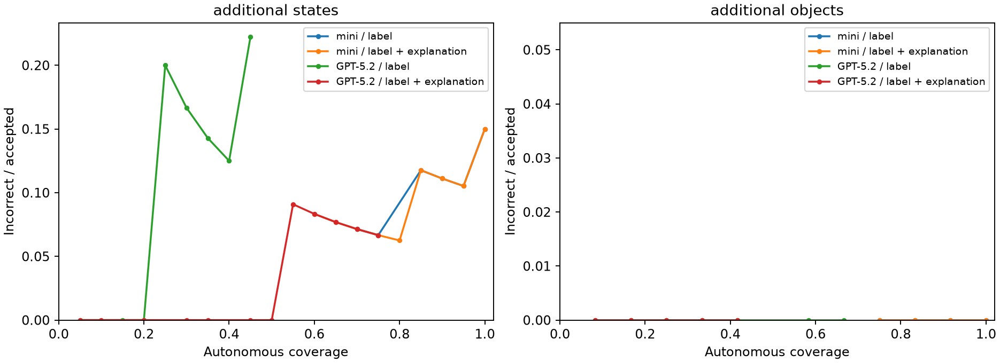

# GPT-5.2: label-only versus label-then-explanation

32 frozen scene-target pairs: states 1–2 across ten LIBERO-Object targets (20 scenes), plus 12 other-object captures. 64 fresh GPT-5.2 calls; comparison reuses only the matching 64 GPT-4.1-mini responses. The first image/logprob probe is included, not an extra trial.

| Cohort | Model | Format | Correct | AUROC | AURC | Available | Wrong ≥.99 |
| --- | --- | --- | ---: | ---: | ---: | ---: | ---: |
| additional_states | gpt-4.1-mini-2025-04-14 | label_only | 17/20 | 0.745098 | 0.055178 | 100% | 3 |
| additional_states | gpt-4.1-mini-2025-04-14 | label_then_evidence | 17/20 | 0.735294 | 0.0614103 | 100% | 2 |
| additional_states | gpt-5.2-2025-12-11 | label_only | 18/20 | 0.785714 | 0.0372817 | 45% | 1 |
| additional_states | gpt-5.2-2025-12-11 | label_then_evidence | 19/20 | 0.714286 | 0.0177964 | 75% | 1 |
| additional_objects | gpt-4.1-mini-2025-04-14 | label_only | 12/12 | unavailable | 0 | 100% | 0 |
| additional_objects | gpt-4.1-mini-2025-04-14 | label_then_evidence | 12/12 | unavailable | 0 | 100% | 0 |
| additional_objects | gpt-5.2-2025-12-11 | label_only | 12/12 | unavailable | 0 | 67% | 0 |
| additional_objects | gpt-5.2-2025-12-11 | label_then_evidence | 12/12 | unavailable | 0 | 42% | 0 |
| pooled | gpt-4.1-mini-2025-04-14 | label_only | 29/32 | 0.718391 | 0.0351377 | 100% | 3 |
| pooled | gpt-4.1-mini-2025-04-14 | label_then_evidence | 29/32 | 0.747126 | 0.0340142 | 100% | 2 |
| pooled | gpt-5.2-2025-12-11 | label_only | 30/32 | 0.866667 | 0.0131148 | 53% | 1 |
| pooled | gpt-5.2-2025-12-11 | label_then_evidence | 31/32 | 0.789474 | 0.00795346 | 62% | 1 |

## Alphabet soup and tomato sauce

Explanations below are unverified model claims, not ground truth or gate inputs.

### task_00_alphabet_soup_state_01 / label_only

Prediction object_007; ground truth object_005; correct False; raw likelihood 0.976906.

```text
G
```

### task_00_alphabet_soup_state_01 / label_then_evidence

Prediction object_007; ground truth object_005; correct False; raw likelihood 0.993267.

```text
G
Small red box labeled “CELTIN” resembles an alphabet soup package.
```

### task_00_alphabet_soup_state_02 / label_only

Prediction object_007; ground truth object_005; correct False; raw likelihood 0.999908.

```text
G
```

### task_00_alphabet_soup_state_02 / label_then_evidence

Prediction object_005; ground truth object_005; correct True; raw likelihood 0.892726.

```text
E
The blue can shows “ALPHABET SOUP” text and soup label, matching alphabet soup.
```

### task_05_tomato_sauce_state_01 / label_only

Prediction object_003; ground truth object_003; correct True; raw likelihood 1.

```text
C
```

### task_05_tomato_sauce_state_01 / label_then_evidence

Prediction object_003; ground truth object_003; correct True; raw likelihood unavailable.

```text
C
The only metal can with a red label, matching a canned tomato sauce container.
```

### task_05_tomato_sauce_state_02 / label_only

Prediction object_003; ground truth object_003; correct True; raw likelihood 0.999767.

```text
C
```

### task_05_tomato_sauce_state_02 / label_then_evidence

Prediction object_003; ground truth object_003; correct True; raw likelihood 0.992767.

```text
C
The only canned food item; tomato sauce is typically in a can with a red/orange label.
```

## Protocol and limitations

Pinned `gpt-5.2-2025-12-11`, reasoning_effort=none (required for temperature/logprobs), temperature=0, image detail=high, max_completion_tokens=128, logprobs=true, top_logprobs=5. Actual endpoint rejected top_logprobs=20 before generating a response. Mini retains 20 diagnostic alternatives; GPT-5.2 uses its supported maximum of five. Only the generated token's own logprob is scored. Existing format-neutral system prompt and both exact user prompts reused. No image rerendering, new crops, candidate reordering, explanation-first condition, target extraction, or new-model prompt tuning.

Raw score = exp(sum of original decision-bearing label-token logprobs). Separable whitespace and explanation tokens are excluded; mixed tokens are indivisible. Generated label selects the object. Missing/sentinel probabilities and invalid/truncated outputs remain unavailable and count as deferred, never zero or fabricated confidence. Candidate-normalized probabilities are not gate inputs.

Threshold curves and exactly matched attainable coverage are exploratory only; ties are never split. Unavailable scores defer. No threshold chosen or old threshold reused. AUROC is undefined with no scored errors. AURC uses the existing trapezoidal tied-endpoint convention; connecting lines between ties are not attainable thresholds. Raw likelihood is not calibrated correctness probability.

Selection uses only fixed scene/state indices, not correctness. Calibration scenes were previously inspected; other-object captures are exploratory, not held-out data. Only two correlated states per original target and one capture per additional object. Additional objects have 3–6 candidates versus seven in LIBERO-Object, so pooled results are descriptive. Historical mini calls and fresh GPT-5.2 calls are not interleaved; backend/time effects are not isolated. Requested high image detail does not guarantee identical internal image preprocessing across model families. No production VLM/HITL/CAD/localization/planner edits.

inputs.json freezes images/localization/GT/prompts/settings and source hashes. responses/ preserves full provider token alternatives. records.json contains new-model trials; comparison.json/associations.csv include the matching mini controls. summary.json includes correct/incorrect distributions and transitions; per_target.csv and matched_coverage.csv provide target counts and both false-accept denominators.

```sh
python -m scripts.run_vlm_gpt52_pilot probe
python -m scripts.run_vlm_gpt52_pilot run
python -m scripts.run_vlm_gpt52_pilot report
```

`probe` is one cached image request; `run` resumes missing calls; `report` is offline. No automatic larger experiment.

[Official GPT-5.2 logprob compatibility](https://developers.openai.com/api/docs/guides/latest-model?model=gpt-5.2)


