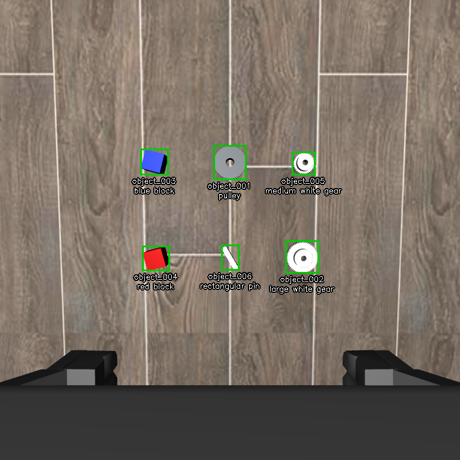
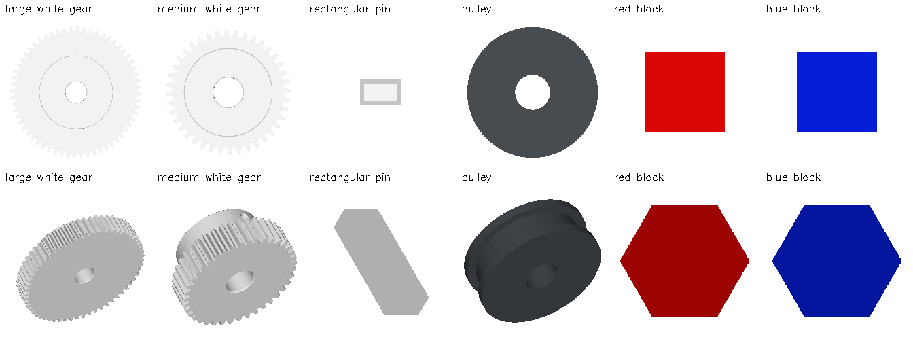

# Six-object wrist-camera CAD association: recorded sample results

This folder is an intentionally published, fixed experiment snapshot for external
analysis. Normal runs continue to write to ignored `outputs/`; they do not overwrite
these samples. It contains one synthetic wrist RGB-D scene and two association runs.
It is a smoke test, not a benchmark accuracy estimate or a physical robot trial.

## Start here

- [All 72 CAD–candidate score rows (CSV)](all_pair_scores.csv): 36 pairs per run,
  full-precision raw metrics, normalized scores, rankings, ground truth, and timing.
- [Latest colored-CAD CPU evaluation](results/colored_cpu/evaluation.json).
- [Earlier gray-CAD GPU evaluation](results/gray_gpu/evaluation.json).
- [Analysis prompt for GPT](ANALYSIS_PROMPT.md).
- [Scene / replay manifest](manifest.json) and [asset / result provenance](provenance.json).
- [Validation](validation.json): 41 focused tests passed; portable CPU replay
  reproduced every prediction and raw visual/geometric score. [File hashes](SHA256SUMS).



The labels above are simulator-ground-truth audit labels, **not predictions**.
Six objects were localized from depth. Simulator object positions were used only
after localization to establish evaluation labels, never as matcher input.

## Results

Both recorded runs achieved visual-only **3/6**, geometry-only **3/6**, and fused
**4/6** top-1 accuracy. The colored run changed raw visual scores without changing
the winning identities. Every target evaluated all six candidates with both modalities.

| Target CAD | Ground-truth object | Visual prediction | Geometry prediction | Fused prediction |
|---|---|---|---|---|
| Large white gear | `object_002` | Large gear | Medium gear | Large gear |
| Medium white gear | `object_005` | Large gear | Medium gear | Medium gear |
| Rectangular pin | `object_006` | Blue block | Medium gear | Blue block |
| Pulley | `object_001` | Pulley | Pulley | Pulley |
| Red block | `object_004` | Blue block | Blue block | Blue block |
| Blue block | `object_003` | Blue block | Blue block | Blue block |

The set is **conflicting**: pin, red-block, and blue-block queries all select
`object_003`. Independent predictions remain available for evaluation, while every
`final_object_id` is null to block downstream handoff. No picks were attempted.

| Recorded cost, seconds | Gray CAD / GPU | Colored CAD / CPU |
|---|---:|---:|
| Entire association set, including lookup and result writing | 2.8123 | 11.8039 |
| CAD visual preprocessing, including first encoder load when needed | 1.9913 | 10.5052 |
| CAD geometric preprocessing | 0.1416 | 0.0000 |
| Scene association, excluding CAD preparation | 0.5781 | 1.2033 |
| Workspace DINOv2 extraction | 0.0241 | 0.6590 |
| Workspace FPFH extraction | 0.0262 | 0.0301 |
| All pairwise geometric matching | 0.2479 | 0.2439 |

These are **not controlled CPU-versus-GPU speed benchmarks**: both CAD appearance
and cache state changed. Gray/GPU had one visual and one geometric cache hit;
colored/CPU had zero visual and six geometric hits. Both used `OMP_NUM_THREADS=1`.
CPU replay used `CUDA_VISIBLE_DEVICES=-1`, and the saved device is `cpu`. Timings
exclude simulation startup, wrist movement, capture, and localization. Per-candidate
DINO times are amortized shares of a batch, not individual inference measurements.

## What was compared

1. Known CAD IDs bypass text retrieval, preserving target description → CAD ID →
   independently ranked localized object ID.
2. Each CAD supplies 14 canonical colored RGB images. Frozen DINOv2-small
   (`dinov2_vits14`) compares each original bounding-box RGB crop against all 14
   descriptors. The maximum cosine is saved. Per-view cosine values were not saved.
3. Each partial observed cloud is compared with the complete sampled CAD cloud
   using local Open3D FPFH, RANSAC, then ICP. No rendered depth templates or
   view-specific partial 3D CAD templates are used.
4. `visual_score = (cosine + 1) / 2`; `geometry_score = registration_fitness`.
   Fusion is the untrained, fixed `0.5 * visual_score + 0.5 * geometry_score` baseline.
   These bounded scores are not calibrated probabilities or equivalent evidence.
5. There is no Top-K pruning, visual gating, size/color filtering, or learned fusion.
   Rankings have no confidence, ambiguity-margin, or absence thresholds. Exact ties
   sort by object ID. Duplicate selections across targets trigger the set conflict.

The RGB inputs are **original rectangular bbox crops**, with inclusive ROI maxima.
They retain background and shadows. The earlier point-cloud-to-image masking
diagnostic has not been applied to DINO inputs.

FPFH uses 5 mm voxels. RANSAC's column is the observed coverage at its initial
alignment. Final fitness uses the better of RANSAC and ICP, with inlier RMSE as
the tie-break. It counts observed points within 7.5 mm of the CAD, not complete
CAD coverage. `observed_to_cad_rmse_m` covers all evaluated observed points;
`inlier_rmse_m` covers inlier correspondences. RMSE is not used in fusion.
Failed registrations retain zero fitness and null RMSE. JSON status `matched`
means a geometric alignment was obtained, not that identity was verified.

## CADs, templates, and observations

The six assets are exact simulator CAD priors, which makes this condition easier
than mismatched physical CADs. Mesh coordinates are meters. Material RGB comes
from the fixed CAD library and is not inferred from observed candidate colors.
The blocks have identical 35 mm cube geometry but different supplied colors.
The pin actually measures **16 × 10 × 50 mm**; earlier square-section wording was
incorrect. Large and medium gears are about 62 and 42 mm in diameter, both 20 mm high.



Templates are fitted independently and therefore do not preserve relative apparent
size across CADs. The six axial and eight diagonal camera directions, in CAD
coordinates, are recorded in `manifest.json`. The CPU ray-cast renderer uses
orthographic views, white backgrounds, and simple normal-based shading.

| Asset | Exact mesh | All 14 colored templates |
|---|---|---|
| Large gear | [STL](cad/Gear_Large_m.stl) | [Sheet](templates/Gear_Large/all_views.png) |
| Medium gear | [STL](cad/Gear_Medium_m.stl) | [Sheet](templates/Gear_Medium/all_views.png) |
| Rectangular pin | [STL](cad/KET16_Square_16mm_m.stl) | [Sheet](templates/KET16_Square_16mm/all_views.png) |
| Pulley | [STL](cad/pulley.stl) | [Sheet](templates/pulley/all_views.png) |
| Red block | [STL](cad/red_block.stl) | [Sheet](templates/red_block/all_views.png) |
| Blue block | [STL](cad/blue_block.stl) | [Sheet](templates/blue_block/all_views.png) |

Individual native-resolution PNGs are alongside each sheet. Original RGB/depth,
camera intrinsics/transforms, unmasked crops, raw cleaned object clouds, and the
localization JSON are in [scene](scene). Clouds are in the camera frame.
The six raw PLYs are the observations used by matching, not completed or augmented CAD clouds.

The gear/pin meshes were converted from the official NIST Task Board 1 archive
identified in [provenance.json](provenance.json); conversion is implemented in
[`simulation/nist_task_board_1.py`](../../simulation/nist_task_board_1.py).
Pulley and blocks are procedural representative assets from
[`simulation/wrist_cluster.py`](../../simulation/wrist_cluster.py).
The simulator is LIBERO/robosuite/MuJoCo; no LIBERO packaged object meshes, model
weights, hardware credentials, or physical camera captures are included here.

## Reproduce association on CPU from the saved scene

From the repository root, with Python and `requirements-association.txt` installed:

```bash
OMP_NUM_THREADS=1 OPENBLAS_NUM_THREADS=1 CUDA_VISIBLE_DEVICES=-1 python - <<'PY'
from pathlib import Path
import shutil
from scripts.run_wrist_association import run_association

sample = Path("experiments/wrist_association_2026-09-11")
output = Path("outputs/wrist_association_shared_replay")
output.mkdir(parents=True, exist_ok=True)
for name in ("manifest.json", "identity_audit.json"):
    shutil.copyfile(sample / name, output / name)
run_association(output)
PY
```

The first DINOv2 use downloads the pinned official pretrained code/weights. No
training, camera, OpenAI/Gemini API key, or running simulator is needed for this
replay. Rendering a new simulated scene needs the existing WSL simulation setup
described in [`simulation/README.md`](../../simulation/README.md).
New replay output is separate from these recorded results. Timing varies with
hardware/cache state; Open3D may vary with environment and parallel scheduling.

Code entry points: [`cad_object_association.py`](../../cad_object_association.py),
[`CADPointCloudRegistration.py`](../../CADPointCloudRegistration.py),
[`main.py`](../../main.py), and
[`scripts/run_wrist_association.py`](../../scripts/run_wrist_association.py).

The published JSON rewrites only asset paths to portable repository-relative
locations; original numeric metrics and timings are preserved. Provenance records
the original result hashes and run-time source hashes. Source snapshots preceded
later wording/documentation changes, so not every historical source hash equals
the current file hash. Analysis must distinguish measured facts from hypotheses.
